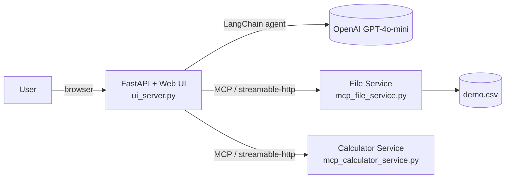

# Simple MCP Server — AI Chat Assistant

A minimal example of the **Model Context Protocol (MCP)** in action: a LangChain agent
backed by GPT-4o-mini that can call tools exposed by two independent MCP servers,
wrapped in a small FastAPI web app with a chat UI.



- **`mcp_file_service.py`** — MCP server exposing CSV tools (`read_csv`, `add_row`, `update_qty`, `delete_row`)
- **`mcp_calculator_service.py`** — MCP server exposing math tools (`subtract`, `divide`, `power`, `mod`)
- **`ui_server.py`** — FastAPI app that wires both MCP servers into a LangChain agent and serves the chat UI in [`ui/`](ui/)
- **`client.py`** — a plain terminal chat client, useful for quick local testing without the web UI

## Run locally

Requires [uv](https://docs.astral.sh/uv/).

```bash
# 1. install dependencies
uv sync

# 2. add your key
echo "OPENAI_API_KEY=sk-..." > .env

# 3. start both MCP servers (separate terminals)
uv run python mcp_file_service.py
uv run python mcp_calculator_service.py

# 4. start the web app
uv run python ui_server.py
```

Open http://localhost:8082.

## Deploy (Docker / Render)

The app ships with a `Dockerfile` and `start.sh` that run both MCP servers and the
web server together in a single container, and a `render.yaml` blueprint for a
one-click deploy on [Render](https://render.com):

1. Push this repo to GitHub (already done if you're reading this from the repo).
2. On Render: **New +** → **Blueprint** → select this repo.
3. Render reads `render.yaml` and asks for the `OPENAI_API_KEY` secret — paste your key.
4. Deploy. Render builds the Docker image and gives you a public URL.

**Note:** the free Render tier spins the service down after 15 minutes of
inactivity, so the first request after idling takes ~30-60s to cold-start.
`demo.csv` also lives on the container's ephemeral disk — it resets on every
redeploy/restart.

### Run the container locally

```bash
docker build -t simple-mcp-demo .
docker run -p 8082:8082 -e OPENAI_API_KEY=sk-... simple-mcp-demo
```
